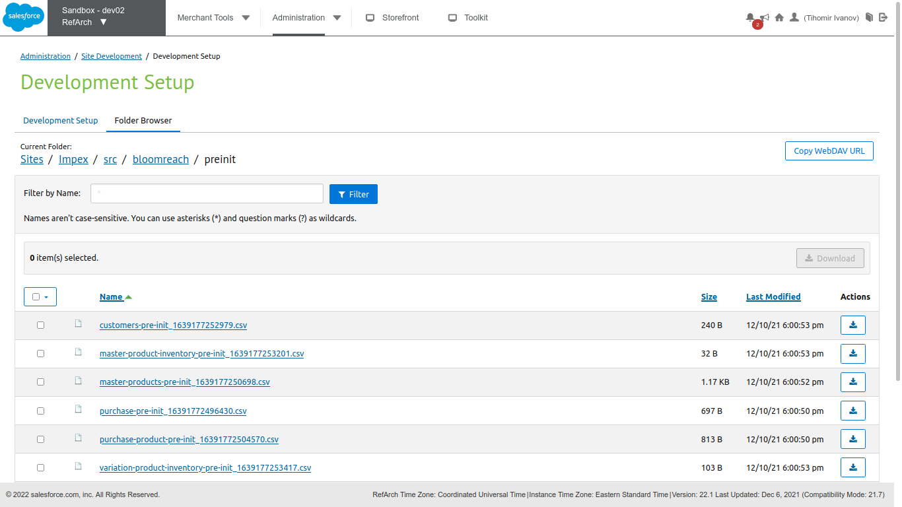
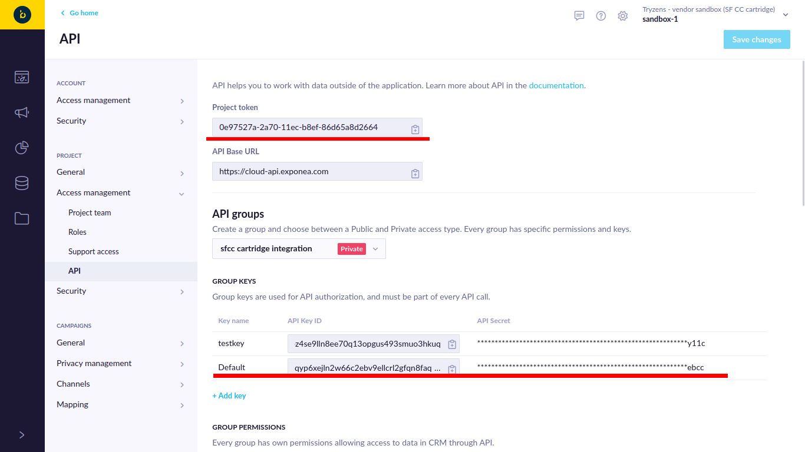
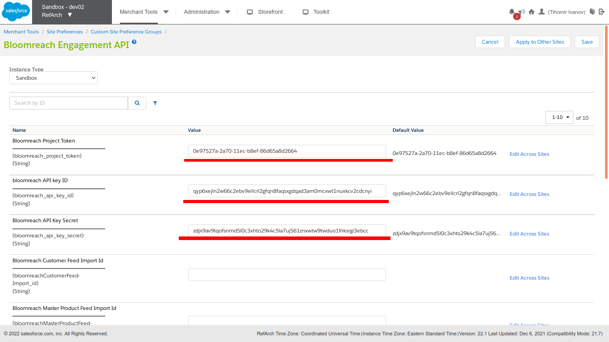
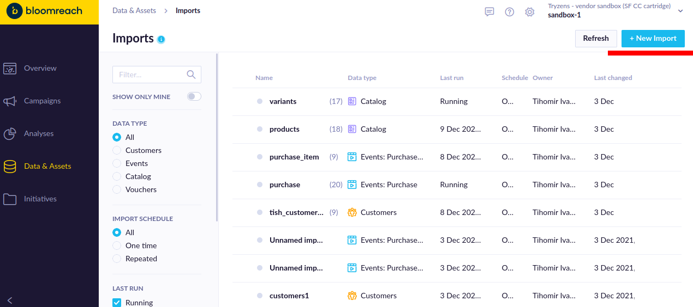
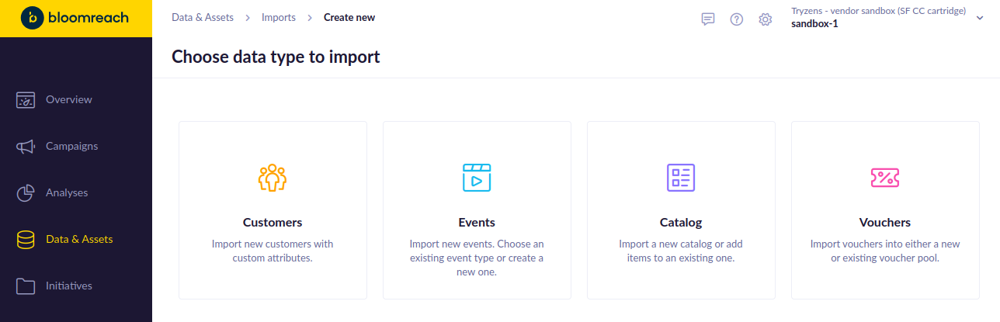
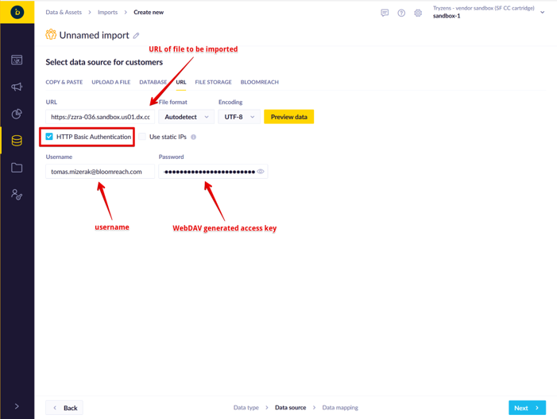
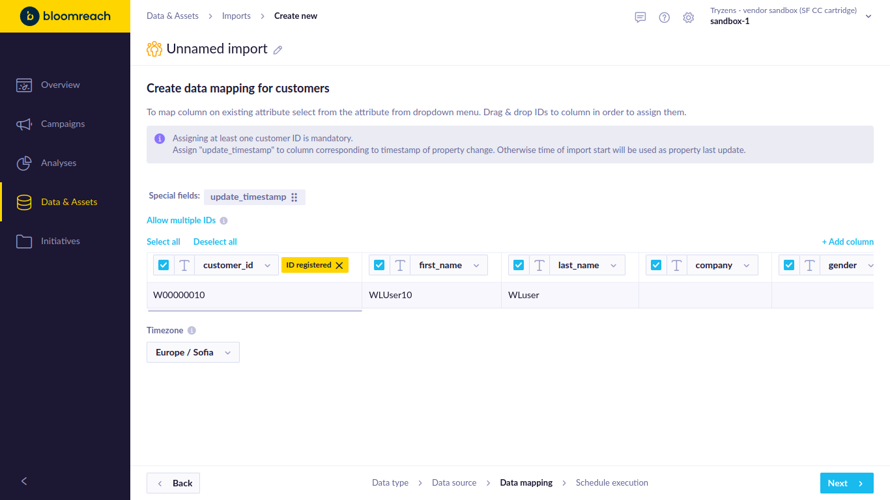
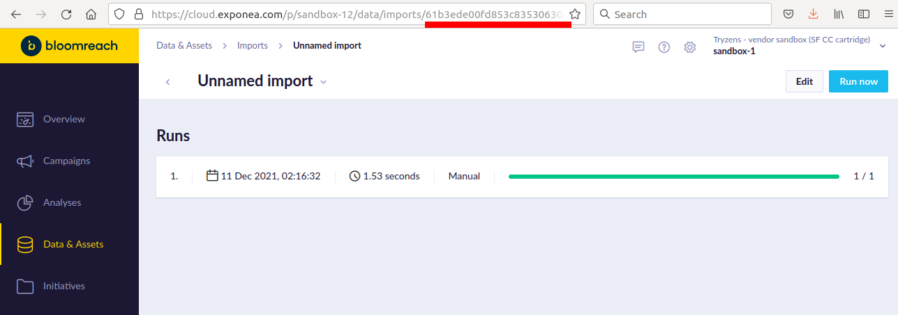
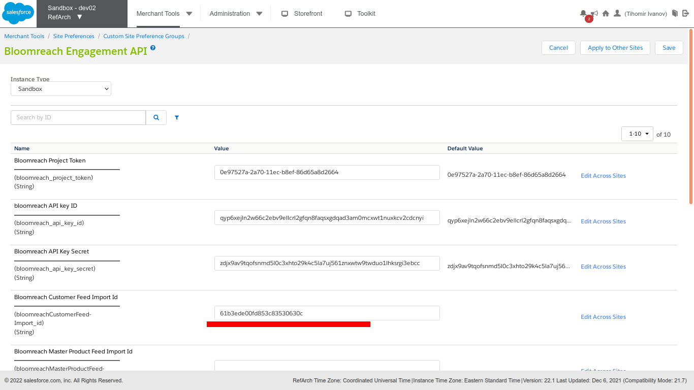

Bloomreach Engagement SFRA Integration

*21\.10\.0*

Table of Contents

- [Component Overview](#component-overview)
  - [Functional Overview](#functional-overview)
  - [Compatibility](#compatibility)
- [Implementation Guide](#implementation-guide)
  - [Setup of Business Manager](#setup-of-business-manager)
  - [Configuration](#configuration)
- [Cartridge Uninstallation Guide](#cartridge-uninstallation-guide)
- [Known Issues](#known-issues)
- [Release History](#release-history)

# Component Overview

## Functional Overview

Bloomreach software enables highly personalized digital experiences for retailers, brands, distributors, manufacturers, and a diverse set of businesses and organizations around the world\.

## Compatibility

*Available since Commerce Cloud Platform Release 16\.8, SFRA 6\.0\.0 *

*The cartridge is available for installations on storefronts that support both Controller and SFRA implemenations\.*

# Implementation Guide

## Setup of Business Manager

*The Bloomreach Engagement LINK Cartridge contains several cartridges that are required for full functionality\. Additionally,  Controller and SFRA support is broken out into two separate cartridges, thereby facilitating the installation and use of one or the other models\. *

*Import all three cartridges into UX studio and associate them with a Server Connection\.*

*Site Cartridge Assignment *

1. *Navigate to Administration > Sites > Manage Sites *
2. *Click on the Site Name for the Storefront Site that will add Bloomreach Engagement Functionality *
3. *Select the “Settings” tab*
4. *For SFRA "int\_bloomreach\_engagement\_sfra:int\_bloomreach\_engagement" need to be added to the cartridge path,  
  
i\.e\. SFRA\-based Site Path:  
 *__*int\_bloomreach\_engagement\_sfra:int\_bloomreach\_engagement*__*:app\_storefront\_base  
*
5. *Repeat steps 2 – 4 for each Storefront Site where Bloomreach Engagement will be implemented*

*Metadata import*

1. *Navigate to BM > Administration >  Site Development >  Import & Export, upload and import  
  
link\_bloomreach\_engagement/metadata/site\-templates/meta/system\-objecttype\-extensions\.xml  
  
and  
  
link\_bloomreach\_engagement/metadata/site\-templates/meta/custom\-objecttype\-definitions\.xml  
*
2. *Navigate to BM > Administration >  Operations >  Import & Export , upload and import  
  
link\_bloomreach\_engagement/metadata/site\-templates/jobs\.xml  
  
Note: If there are data errors after import i\.e\. Finished \(11 data errors\), it could be caused by not applied jobsteps\.json changes\. In such case, please activate another code version, then re\-activate the current code version and re\-import the jobs file\.  
*
3. *Navigate to BM > Administration >  Operations >  Import & Export , upload and import*

## Configuration

*1\. Navigate to Administration > Operations > Jobs, assign proper site\(s\) to each of the Bloomreach jobs \(by default they are assigned to RefArch site\):*

- *Bloomreach \- CustomerFeed \(Delta Export\)*
- *Bloomreach \- CustomerFeed \(Full Export\)*
- *Bloomreach \- MasterProductFeed \(Full Export\)*
- *Bloomreach \- MasterProductInventoryFeed*
- *Bloomreach \- VariationProductFeed \(Full Export\)*
- *Bloomreach \- VariationProductInventoryFeed*
- *Bloomreach\- Generate \(Pre\-Init\) CSV Files*
- *Bloomreach\-Purchase Feed \(FullExport\)*
- *Bloomreach\-Purchase Feed \(NewOrders\)*
- *Bloomreach\-Purchase Product Feed \(FullExport\)*
- *Bloomreach\-Purchase Product Feed \(NewOrders\)*

*2\. Navigate to Administration > Operations > Jobs and execute ‘Bloomreach\- Generate \(Pre\-Init\) CSV Files’ Job*

*It will generate csv files used to define Imports on Bloomreach account\.*

*Then navigate to BM > Administration > Site Development > Development Setup > Open WebDAV Access folder: Sites > Impex > src > bloomreach > preinit*

**

*The csv full URL file paths will be used on further steps\.*

*3\. Open Bloomreach API settings page:*

[https://cloud\.exponea\.com/p/sandbox\-12/project\-settings/api](https://cloud.exponea.com/p/sandbox-12/project-settings/api)

\- Copy\-Paste the ‘Project Token’, ‘API Key ID’ and ‘API Secret’ to BM > Merchant Tools > Custom Preferences > ‘Bloomreach Engagement API’ > ‘Bloomreach Project Token’, ‘Bloomreach API Key ID’ and ‘Bloomreach API Key Secret’:

and Save changes\.

4\. Navigate to Bloomreach Account > Left Menu > Data & Assets > Imports \([https://cloud\.exponea\.com/p/sandbox\-12/data/imports](https://cloud.exponea.com/p/sandbox-12/data/imports)\)

and click on '\+ New Import' button

5\. Select Type you want to create an Import

Select ‘URL’ and fill CSV URL path from step 2 with WebDAV access for your sandbox:

Finish the import \(1 row will be imported\)

Copy the import\_id from the import definition URL from the Exponea app

and set that value to corresponding Import ID in BM > Merchant Tools > Custom Preferences > ‘Bloomreach Engagement API’:

Repeat the above steps for repeat all data feeds

  
Customer feed => "Customer" type import

  
Purchase feeds => "Event" type import, event name "purchase" and "purchase\_item" \(for line items\)

  
Catalog feeds => "Catalog" type import, catalog name "products" \(for master, bundles and single products\) and "variants" \(for single products\)

5\. *Navigate to Administration > Operations > Jobs and execute Bloomreach jobs:*

- *Bloomreach \- CustomerFeed \(Delta Export\)*
- *Bloomreach \- CustomerFeed \(Full Export\)*
- *Bloomreach \- MasterProductFeed \(Full Export\)*
- *Bloomreach \- MasterProductInventoryFeed*
- *Bloomreach \- VariationProductFeed \(Full Export\)*
- *Bloomreach \- VariationProductInventoryFeed*
- *Bloomreach\-Purchase Feed \(FullExport\)*
- *Bloomreach\-Purchase Feed \(NewOrders\)*
- *Bloomreach\-Purchase Product Feed \(FullExport\)*
- *Bloomreach\-Purchase Product Feed \(NewOrders\)*

You can execute \(Full Export\) jobs manually and schedule recurring execution of Delta exports\.

6\.Job Schedule: *Navigate to Administration > Operations > Jobs:  
*

- Open the job need to be Scheduled\.
- Click on Schedule and History Tab\.
- Select Trigger \(reoccurring intervals\)\.
- Configure the From and To dates if required\.
- Set the run time for the job intervals\.
	- Set the amount\.
	- Set the interval \(Minutes, Hours, Days, Weeks and Months\)\.
	- Select the days on with you want to run the job as per scheduled intervals\.

Repeat the above steps to schedule all required jobs\.

# Cartridge Uninstallation Guide

- Remove the Cartridge from the code base\.
- Remove Cartridge name from Cartridges path\.
- All the configurations can be removed manually from the Business Manager\.
- All the csv files created by the Cartridge can be removed/deleted manually from WebDAV\.

WebDAV file removal: 

- Navigate to Administration > Site Development > Development Setup\.
- Open the Import/Export folder\.
- Open src folder\.
- Copy WebDAV URL and open that URL in new Tab\.
- Deleted the “bloomreach” folder\.

# Known Issues

The LINK Cartridge has no known issues\.

# Release History

__Version__

__Date__

__Changes__

21\.10\.0

2021\-10\-25

Initial release
